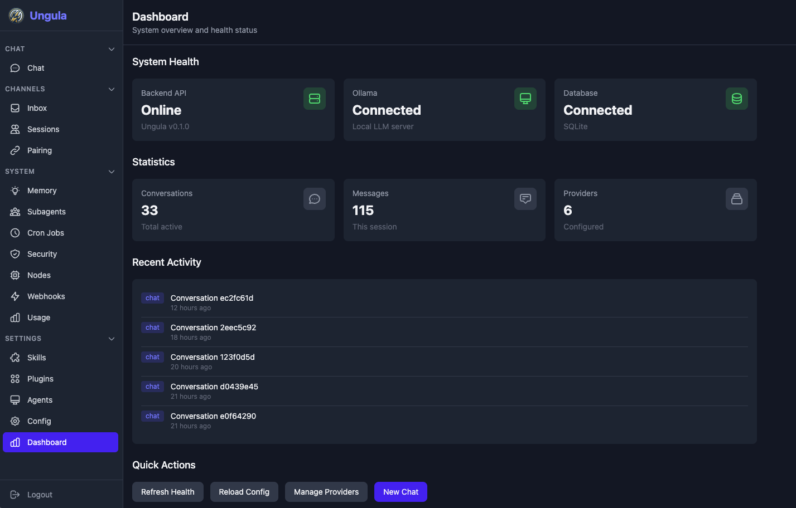

<p align="center">
  
</p>

# Ungula

*Ungula* is a Latin term meaning "hoof, nail, or claw."

**Autonomous AI agent platform with multi-model orchestration, extensible skills, and multi-channel messaging.**

Ungula is a fully refactored version of [OpenClaw](https://github.com/maxgoff/openclaw), rebuilt from the ground up in Python (FastAPI) and React. It is a self-hosted AI agent system that runs 24/7 — processing tasks, managing conversations across Discord/Telegram/Slack/Signal/iMessage, executing tools in a sandboxed environment, and coordinating companion devices over your LAN.



## Features

- **8 LLM Providers** — OpenRouter, Anthropic, OpenAI, Google, xAI, NVIDIA, Ollama, and custom OpenAI-compatible endpoints. Automatic failover between providers.
- **5 Messaging Channels** — Discord, Telegram, Slack, Signal, and iMessage. Unified inbox with session management and SSE event streaming.
- **Extensible Skills** — Built-in tools (shell, file ops, web search, browser automation, URL fetch) plus a skill marketplace (ClawHub) with security scanning.
- **Agent Orchestration** — Per-agent configuration (model, temperature, provider), subagent spawning, context compaction, and tool-calling loops with streaming.
- **Companion Nodes** — Pair devices over WebSocket for distributed command execution with approval workflows.
- **Vector Memory** — Semantic search over conversation history and workspace files with embedding cache and auto-indexing.
- **Webhook System** — Inbound webhooks with signature verification, Jinja2 templates, and event retention.
- **Plugin System** — Discover, install, and manage plugins that extend tools and channels.
- **Cron Scheduling** — Schedule recurring agent tasks with cron expressions.
- **Docker Sandbox** — Isolate tool execution in hardened containers with resource limits.
- **Security Auditing** — Built-in security scanner with auto-remediation.
- **React Dashboard** — Full-featured frontend for chat, inbox, skills, nodes, webhooks, plugins, memory, cron, agents, usage monitoring, and more.

## Architecture

```
                         React Dashboard (:3001)
                                |
                           Vite proxy /api
                                |
                      +-------------------+
                      |  FastAPI (:8001)   |
                      |   Rate-limited     |
                      +-------------------+
                       /    |    |    \
              +-------+  +--+  ++--+  +--------+
              | Agent |  |LLM| |WS |  |Channels|
              |Runner |  |Reg| |Mgr|  |Registry|
              +-------+  +--+  +---+  +--------+
               /     \     |           /  |  |  \
          +------+ +-----+ |    Discord Telegram Slack Signal iMessage
          |Tools | |Skills| |
          +------+ +-----+ |
           |    |     |     |
        shell file  web   8 providers
        browser     search (failover)
           |
      Docker Sandbox
                                    +--------+
                      WebSocket --- | Node   |
                      /ws/node      | Client |
                                    +--------+
```

## Quick Start

### Prerequisites

- Python 3.11+
- Node.js 18+ (for the frontend)
- SQLite (bundled with Python)
- Docker (optional, for sandbox)

### Backend

```bash
cd backend
python -m venv .venv
source .venv/bin/activate    # Windows: .venv\Scripts\activate
pip install -e ".[dev]"

# Initialize config
mkdir -p ~/.ungula
cat > ~/.ungula/config.yaml << 'EOF'
server:
  host: 0.0.0.0
  port: 8001

llm:
  default_provider: anthropic
  anthropic:
    api_key: YOUR_KEY_HERE

auth:
  secret_key: CHANGE-ME-IN-PRODUCTION
EOF

# Run the server
python -m ungula.main
```

The backend starts at `http://localhost:8001`. API docs are available at `http://localhost:8001/docs` (Swagger UI).

### Frontend

```bash
cd frontend
npm install
npm run dev
```

The dashboard opens at `http://localhost:3001` and proxies API requests to the backend.

### First Steps

```bash
# Register a user
curl -X POST http://localhost:8001/api/auth/register \
  -H "Content-Type: application/json" \
  -d '{"email": "you@example.com", "password": "your-password"}'

# Login to get a JWT token
curl -X POST http://localhost:8001/api/auth/login \
  -H "Content-Type: application/json" \
  -d '{"email": "you@example.com", "password": "your-password"}'

# Create a conversation and chat
curl -X POST http://localhost:8001/api/conversations/ \
  -H "Authorization: Bearer YOUR_TOKEN" \
  -H "Content-Type: application/json" \
  -d '{"title": "Hello"}'

curl -X POST http://localhost:8001/api/chat/CONVERSATION_ID \
  -H "Authorization: Bearer YOUR_TOKEN" \
  -H "Content-Type: application/json" \
  -d '{"content": "What can you do?"}'
```

## Configuration

Ungula reads configuration from `~/.ungula/config.yaml` with environment variable overrides.

### Key Environment Variables

| Variable | Description |
|---|---|
| `UNGULA_HOME` | Config directory (default: `~/.ungula`) |
| `UNGULA_AUTH_SECRET_KEY` | JWT signing secret |
| `UNGULA_OPENROUTER_API_KEY` | OpenRouter API key |
| `UNGULA_ANTHROPIC_API_KEY` | Anthropic API key |
| `UNGULA_OPENAI_API_KEY` | OpenAI API key |
| `UNGULA_GOOGLE_API_KEY` | Google AI API key |
| `UNGULA_XAI_API_KEY` | xAI (Grok) API key |
| `UNGULA_NVIDIA_API_KEY` | NVIDIA NIM API key |
| `UNGULA_DISCORD_TOKEN` | Discord bot token |
| `UNGULA_SERVER_HOST` | Server bind address |
| `UNGULA_SERVER_PORT` | Server port |

### Workspace Files

The workspace directory (`~/.ungula/workspace/`) contains markdown files that shape agent behavior:

| File | Purpose |
|---|---|
| `SOUL.md` | Agent persona and behavioral boundaries |
| `USER.md` | User context and preferences |
| `IDENTITY.md` | Agent identity definition |
| `AGENTS.md` | Master workspace guide |
| `TOOLS.md` | Local tool configuration notes |
| `MEMORY.md` | Long-term memory |
| `HEARTBEAT.md` | Periodic task checklist |
| `BOOT.md` | Startup tasks (run on server start) |

Initialize workspace from templates:

```bash
curl -X POST http://localhost:8001/api/config/initialize-workspace
```

## Project Structure

```
ungula/
├── backend/
│   ├── ungula/
│   │   ├── agents/          # Agent runner, factory, subagents, context compaction
│   │   ├── api/routes/      # 19 route modules (~100+ endpoints)
│   │   ├── browser/         # Playwright browser automation
│   │   ├── channels/        # (see messaging/)
│   │   ├── cron/            # Cron scheduler
│   │   ├── hooks/           # Boot tasks
│   │   ├── llm/             # 8 LLM provider adapters + failover
│   │   ├── memory/          # Vector memory with embeddings
│   │   ├── messaging/       # Discord, Telegram, Slack, Signal, iMessage
│   │   ├── nodes/           # Companion device management
│   │   ├── pairing/         # Device pairing workflow
│   │   ├── plugins/         # Plugin system (loader, registry, installer)
│   │   ├── sandbox/         # Docker sandbox for tool execution
│   │   ├── security/        # Security auditor
│   │   ├── skills/          # Skills framework + built-in tools
│   │   │   └── builtin/     # shell, file_ops, browser, web_search, url_fetch, ...
│   │   ├── storage/         # SQLAlchemy models + SQLite backend
│   │   ├── tools/           # Tool registry + policy engine
│   │   ├── webhooks/        # Webhook manager + templates
│   │   ├── config.py        # Pydantic configuration models
│   │   └── main.py          # FastAPI application entry point
│   ├── tests/               # pytest test suite (2200+ tests)
│   └── pyproject.toml
├── frontend/
│   ├── src/
│   │   ├── pages/           # 17 page components (Chat, Inbox, Skills, Nodes, ...)
│   │   ├── components/      # Shared UI components
│   │   └── api.js           # API client
│   ├── package.json
│   └── vite.config.js
├── node-client/             # Companion device client SDK
│   ├── ungula_node/
│   │   ├── client.py        # WebSocket client
│   │   ├── cli.py           # CLI (connect, pair, status, approve, reject)
│   │   ├── capabilities.py  # Capability registration
│   │   └── handlers.py      # Built-in command handlers
│   └── pyproject.toml
├── docs/                    # Documentation
│   ├── api-reference.md     # API endpoint reference
│   ├── deployment.md        # Deployment guide
│   └── templates/           # Workspace file templates
├── skills/                  # User skill directory
├── CLAUDE.md                # Development guidelines
└── PLAN.md                  # Development roadmap
```

## Development

### Running Tests

```bash
cd backend
source .venv/bin/activate
pytest                    # Run all tests
pytest -x                 # Stop on first failure
pytest --cov=ungula       # With coverage
```

### Linting

```bash
cd backend
ruff check .              # Lint
ruff format .             # Format

cd frontend
npm run lint              # ESLint
```

### Adding a Skill

Skills are Python packages in `~/.ungula/skills/` or `backend/ungula/skills/builtin/`. Each skill has a `manifest.yaml` and one or more tool modules. See existing built-in skills for examples.

Skills can also be installed from ClawHub:

```bash
curl -X POST http://localhost:8001/api/skills/clawhub/install \
  -H "Content-Type: application/json" \
  -d '{"slug": "skill-name"}'
```

## Documentation

- **[API Reference](docs/api-reference.md)** — Complete endpoint documentation with request/response shapes and curl examples.
- **[Deployment Guide](docs/deployment.md)** — Local development, production setup, channel configuration, Docker sandbox, and node client.

## License

[MIT](LICENSE)
